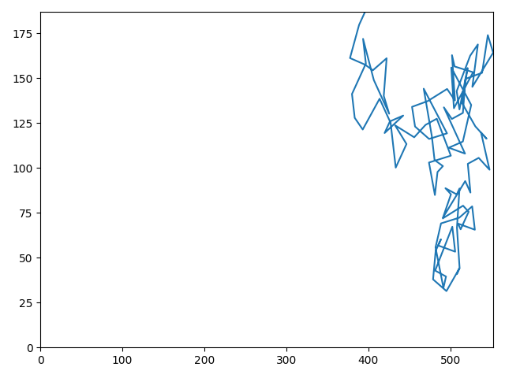

# rw-seg
Terse approach to segmenting random walk data

## sample input: random walk data

## counts of the above, on a regularly spaced square grid

## classification: labelling performed by recursive hill-climbing on the counts

## counts on regularly spaced square grid, normalized to [0, 1] with respect to each label

## code

